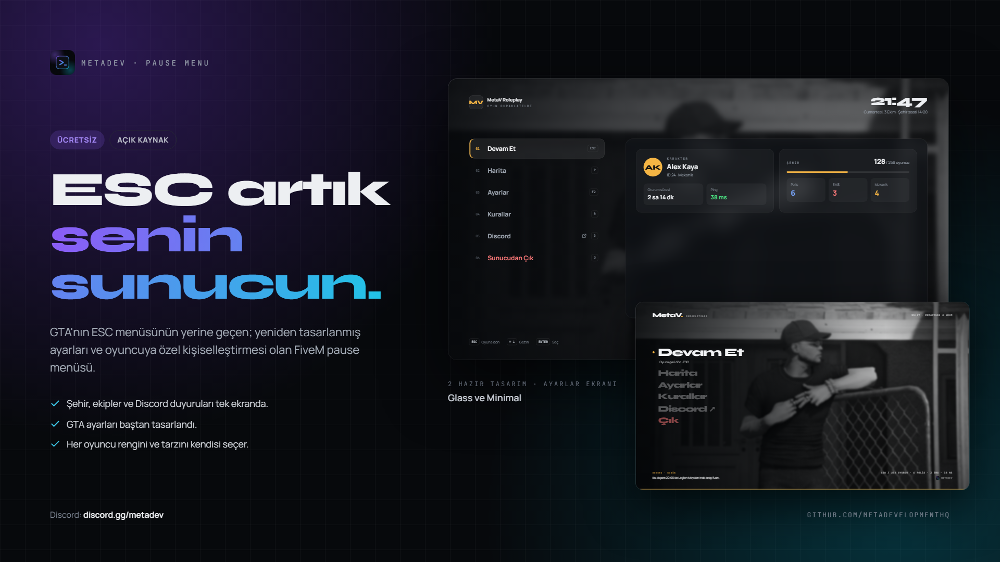
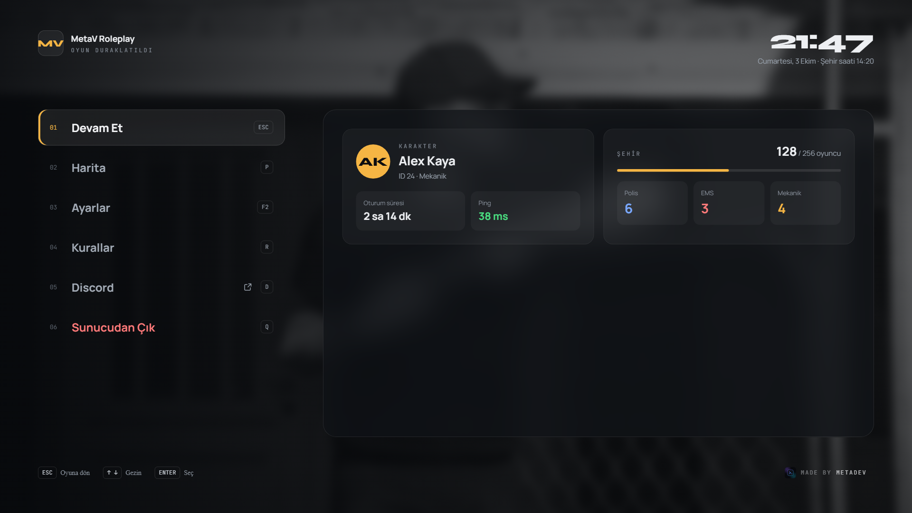
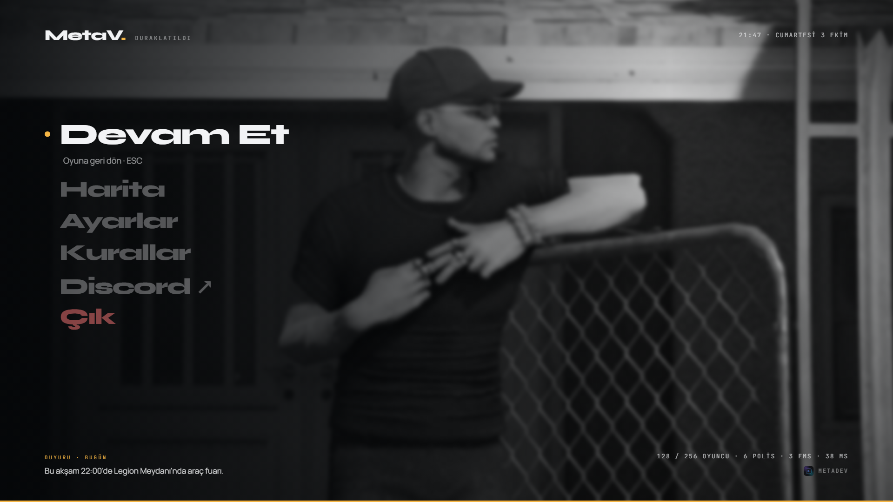
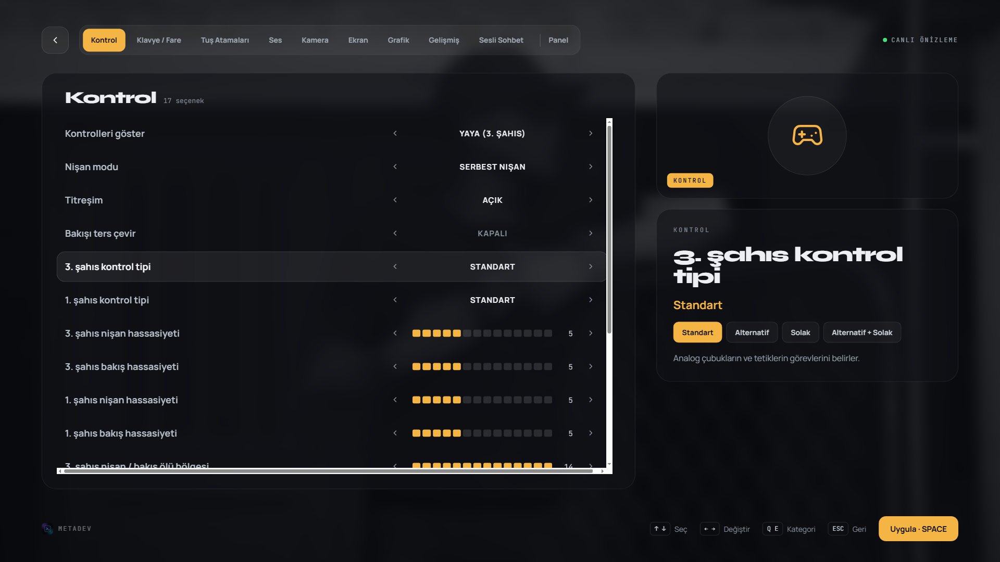

<div align="center">



# MetaDev Pause Menu

**Oyuncular günde onlarca kez ESC'ye basıyor. Artık GTA'nın menüsünü değil, senin sunucunu görüyorlar.**

GTA'nın ESC menüsünün yerine geçen; yeniden tasarlanmış ayarları ve oyuncuya özel kişiselleştirmesi olan, ücretsiz ve açık kaynak FiveM pause menüsü.

[](LICENSE)
[](#kurulum)
[](#framework-desteği)
[](https://discord.gg/metadev)

[English](README.md) · **Türkçe**

</div>

---

## Özellikler

### Sunucunun ikinci yüzü
ESC'ye bas, şehri bir bakışta gör: karakter kartı, çevrimiçi oyuncu sayısı, görevdeki meslek sayıları ve Discord kanalından otomatik gelen son duyurular.

### Yeniden tasarlanmış ayarlar
GTA'nın ayar menüsü aynı temiz arayüzle baştan tasarlandı: kontrol, klavye ve fare, tuş atamaları, ses, kamera, ekran, grafik, gelişmiş grafik ve sesli sohbet.

### Her oyuncu kendine göre ayarlar
**Panel** sekmesinden her oyuncu vurgu rengini, köşe stilini, menü düzenini, menü ve yazı boyutunu, arka plan bulanıklığını, hatta menü tarzını seçebilir. Bu tercihler sadece oyuncunun kendi bilgisayarında saklanır, oyunun ayarlarına dokunmaz.

### Sunucu sahibi için
- **Kurallar**, **Discord**, **Harita** ve **Ayarlar** butonlarını aç/kapat
- Hangi meslek sayılarının gösterileceğini seç (en fazla 4) ya da tamamen gizle
- **Discord** butonu davet linkini doğrudan oyuncunun tarayıcısında açar
- Duyurular bir **Discord kanalından** ya da config'ten
- Belirli GTA ayarlarını tüm sunucu için kilitle (örneğin sadece serbest nişan)
- **2 tasarım:** Glass ve Minimal

### Oyunun bir parçası gibi
- Menü açıkken oyun arkada akmaya devam eder, GTA'nın kendi bulanıklığıyla
- Tam klavye ve fare desteği: `↑ ↓` seç, `← →` değiştir, `Q` `E` kategori, `Enter` onayla, `Esc` geri
- Kapalıyken neredeyse sıfır kaynak kullanımı

## Ekran görüntüleri

| Glass | Minimal |
|---|---|
|  |  |



## Kurulum

1. [Son sürümü](../../releases/latest) indir ve `resources` klasörüne çıkar.
2. Klasör adının `metadev-pausemenu` olduğundan emin ol.
3. `server.cfg` dosyana şu satırı ekle:
   ```cfg
   ensure metadev-pausemenu
   ```
4. Sunucuyu yeniden başlat. Bu kadar.

> Aynı tasarım diliyle hazırlanan [MetaDev Loadscreen](https://github.com/MetaDevelopmentHQ/loadscreen) ile birlikte kullanmak için birebir.

## Yapılandırma

`config.lua` dosyasını aç:

```lua
Config.Locale        = 'tr'                 -- 'tr' veya 'en'
Config.Style         = 'glass'              -- 'glass' veya 'minimal' (oyuncu değiştirebilir)
Config.Accent        = '#F5B544'
Config.ServerName    = 'Sunucunun Adı'
Config.Framework     = 'auto'               -- 'auto', 'esx', 'qb', 'qbox', 'standalone'
Config.DiscordInvite = 'https://discord.gg/sunucun'

Config.Menu = { map = true, settings = true, rules = true, discord = true }

Config.Jobs = {
  enabled = true,
  onDutyOnly = true,
  list = {                                  -- en fazla 4
    { job = 'police',    label = 'Polis',   color = '#7AA8FF' },
    { job = 'ambulance', label = 'EMS',     color = '#FF7A7A' },
    { job = 'mechanic',  label = 'Mekanik', color = 'accent'  },
  },
}
```

### Discord duyuruları

1. [Discord Developer Portal](https://discord.com/developers/applications)'da bir bot oluştur ve duyuru kanalını okuyabilecek izinle sunucuna ekle.
2. Token'ı `server.cfg` dosyasına koy; oyunculara asla gitmez:
   ```cfg
   set metadev_pause_discord_token "BOT_TOKENIN"
   ```
3. `config.lua`'da `Config.Announcements.source = 'discord'` yap ve kanal ID'sini yaz.

## Framework desteği

Standalone çalışır. `Config.Framework` değeri `auto` ise ESX, QBCore ve Qbox otomatik algılanır. Framework yalnızca karakter adı, meslek ve meslek sayıları için kullanılır; standalone modda bu kısımlar otomatik gizlenir.

## Sık sorulan sorular

**Gerçekten ücretsiz mi?**
Evet. MIT lisansıyla ücretsiz ve açık kaynak.

**Oyun duraklıyor mu?**
Hayır. GTA Online'daki gibi dünya akmaya devam eder. Menü açıkken oyuncunun kontrolleri kilitlenir.

**Bazı ayarlarda "GTA ayarlarında aç" yazıyor. Neden?**
Her GTA ayarı scriptten değiştirilemiyor. Bu ayarlar mevcut değerini gösterir ve GTA'nın kendi ayarlarında ilgili sayfayı açar.

**Oyuncular renkleri değiştirebilir mi?**
Evet. Her oyuncu Panel sekmesinden kendi vurgu rengini ve tarzını seçebilir. Senin seçimin diğer herkes için varsayılan olarak kalır.

## Destek

Sorular ve hata bildirimleri için: **[discord.gg/metadev](https://discord.gg/metadev)**

Hata mı buldun? [Issue aç](../../issues).

## Lisans

[MIT](LICENSE) © MetaDev
