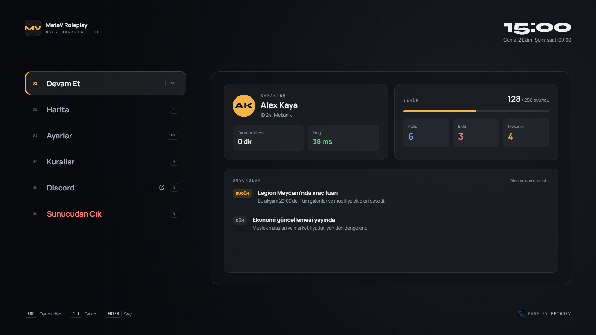

# MetaDev Pause Menu

A free, open-source pause menu for FiveM that replaces GTA's ESC menu. Two designs (**Glass** and **Minimal**), a full **settings screen** that replaces GTA's settings, Discord announcements, job counts and per-player panel preferences. Made by MetaDev, sharing the design language of `metadev-loadscreen`.

> 🇹🇷 Türkçe dokümantasyon: [docs/tr](docs/tr/kurulum.md)



## Features

- **Takes over ESC and P.** GTA's pause menu never opens; the game keeps running behind the menu.
- **Two styles, one data layer.** Glass (cards + glass panel) and Minimal (big type). Players can pick their own style.
- **Real background blur** via GTA's own screen effects (`TriggerScreenblurFadeIn`), not CSS. Strong in Glass, light in Minimal, can be turned off.
- **Overview panel:** character name and job (ESX / QBCore / Qbox) or FiveM name (standalone), session time, ping, players online, up to 4 job counts, last 2 announcements, real clock and in-game city time.
- **Announcements** from the config or straight from a **Discord channel** (bot token stays on the server).
- **Map** opens GTA's full screen map directly and returns to the menu when closed.
- **Discord** opens the invite in the player's browser.
- **Leave Server** with confirmation, handled on the server.
- **Settings screen** with every GTA settings category, read from the game where FiveM allows it, plus a **Panel** category for this menu (layout, corners, accent colour, style, scale, text size, blur).
- **Server locks** for settings that can be enforced (e.g. free aim).
- Fully usable with **keyboard and mouse**. Turkish and English included.
- **No build step.** Vanilla HTML/CSS/JS (ES modules), local fonts.
- **~0.00–0.01 ms** while closed.

## Installation

1. Drop the `metadev-pausemenu` folder into your `resources`.
2. Add it to `server.cfg` **after** your framework:
   ```cfg
   ensure metadev-pausemenu
   ```
3. Edit `config.lua` (server name, accent colour, menu entries, rules, jobs, announcements).
4. Optional, Discord announcements: see [docs/en/discord-announcements.md](docs/en/discord-announcements.md).

Full guide: [docs/en/installation.md](docs/en/installation.md)

## Documentation

| | English | Türkçe |
|---|---|---|
| Installation | [installation.md](docs/en/installation.md) | [kurulum.md](docs/tr/kurulum.md) |
| Config reference | [config.md](docs/en/config.md) | [config.md](docs/tr/config.md) |
| Discord announcements | [discord-announcements.md](docs/en/discord-announcements.md) | [discord-duyurular.md](docs/tr/discord-duyurular.md) |
| GTA settings feasibility | [settings-feasibility.md](docs/en/settings-feasibility.md) | [ayar-fizibilite.md](docs/tr/ayar-fizibilite.md) |
| FAQ | [faq.md](docs/en/faq.md) | [sss.md](docs/tr/sss.md) |

## Controls

| Key | Pause menu | Settings screen |
|---|---|---|
| `↑ ↓` | Move | Move |
| `← →` | Theme colour (on Settings) | Change value |
| `Q / E` | – | Previous / next category |
| `ENTER` | Select / confirm | Toggle, or open GTA settings for read-only rows |
| `SPACE` | – | Apply |
| `ESC` | Close | Back (asks if there are unapplied changes) |
| `P F2 R D Q` | Shortcuts (configurable) | – |

## Technical decisions

These are the judgement calls made while building it, so you know what to expect:

- **GTA settings are read-only for scripts.** FiveM exposes `GetProfileSetting` for reading but no native for writing profile settings. Only settings that have their own runtime native (targeting mode, third person camera distance) are applied directly; they are stored in KVP and re-applied on every join. Everything else readable is shown with an "Open in GTA settings" shortcut, and settings FiveM can't read at all (most graphics options) are hidden. Details: [settings feasibility](docs/en/settings-feasibility.md).
- **Minimal's light blur** uses the `hud_def_blur` timecycle at low strength because `TriggerScreenblurFadeIn` has no strength parameter. If another script already uses a timecycle modifier, the menu falls back to the regular screen blur so it doesn't overwrite it.
- **Map:** `ActivateFrontendMenu('FE_MENU_VERSION_MP_PAUSE')` + `PauseMenuceptionGoDeeper(0)` opens the full screen map. ESC/P inside the map closes it and brings back the pause menu (`Config.ReturnAfterMap`).
- **GTA settings shortcut** opens `FE_MENU_VERSION_LANDING_MENU` (key binding rows open `FE_MENU_VERSION_LANDING_KEYMAPPING_MENU`). GTA has no reliable way to jump to a specific settings sub-page from script.
- **ESC is handled on key-up** inside the NUI so the release doesn't leak back into the game and reopen the menu.
- **Session time** is counted on the client from the moment the resource starts for that player (i.e. when they join). Restarting the resource resets it.
- **Discord openUrl:** `window.invokeNative('openUrl', url)` from the NUI. Only `discord.gg` / `discord.com` links are accepted.
- **P key** opens this menu by default (as specified). Set `Config.PauseKeyAction = 'map'` to keep GTA's "P opens the map" habit.
- **Browser preview:** serve the resource folder (`npx serve .`) and open `/web/index.html` to see the UI with sample data (`?style=minimal`, `?screen=settings`, `?lang=en`).

## License

MIT, see [LICENSE](LICENSE). Fonts are OFL 1.1.

Made by **MetaDev**.
